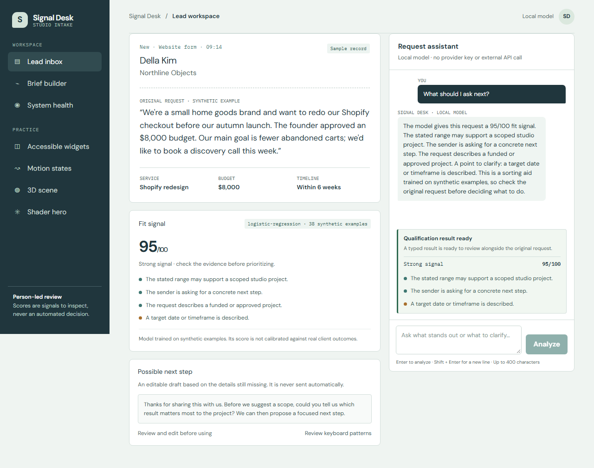

# Signal Desk

Signal Desk is an AI-assisted lead triage workspace for independent creative
studios. It helps a small team review project inquiries, see why a request may
fit, and prepare a useful follow-up. A person stays in control: the product
does not reject leads or send messages automatically.

The default qualification model is a small logistic-regression classifier
trained on synthetic examples. It returns evidence and a confidence estimate,
not a decision. The project is intentionally scoped as a portfolio application;
it is not a validated sales predictor and should not be used to make decisions
about people.



## Run locally

```powershell
cd web
npm install
npm run dev
```

Open `http://localhost:3000`. The app needs no environment variables or API
key; its classifier and sample records are local and synthetic.

## Architecture and AI behavior

- Next.js App Router pages provide the inbox, lead workspace, health view, and practice routes.
- `web/src/lib/ai/` validates requests, applies the locally trained logistic-regression model, and produces a typed qualification result.
- The assistant stream uses the local model and deterministic response flow. It does not call an external LLM or send messages.
- The model surfaces evidence for human review; it does not decide which people qualify.

### Environment variables

| Variable | Required | Purpose |
|---|---|---|
| None | No | The default build and local model work without provider credentials. |

## Deployment status

The repository is public and hosted CI passes on `main` and both workflow exercise branches. A live application URL is not available yet; deployment and production smoke checks remain outstanding.

## Project map

- `web/src/app/` — app routes and server handlers
- `web/src/lib/ai/` — input validation, model, and qualification tool
- `web/src/components/` — lead workspace and reusable UI
- `docs/assignments/` — assignment-specific notes and evidence
- `docs/capstone/` — deployment checklist, audit, and reflection
- `SPEC.md` — audience, problem, scope, and AI role

## Quality checks

Run `npm run train`, `npm run lint`, `npm run typecheck`, `npm run test`,
`npm run coverage`, `npm run build`, and `npm run e2e` from `web/`. The
Playwright flow uses local fixtures and the local classifier, never a live AI
service. See `docs/assignments/TESTING.md` for the recorded results.

## Known limitations

The classifier is trained on 38 synthetic examples and is not calibrated against real outcomes. The assistant is a deterministic local flow, not a provider-backed LLM. The request limiter is per-process, and a live deployment, WAVE report, and manual screen-reader review remain outstanding.

## AI-assisted development

Codex helped map the assignment briefs, scaffold the project, and draft code.
The author reviewed generated changes and added or corrected validation,
keyboard behavior, evidence labels, and failure handling. See
[`docs/AI_WORKLOG.md`](docs/AI_WORKLOG.md) for the work log. Screenshots,
deployment and audit results are recorded only after they are actually captured.

## License

MIT. See [`LICENSE`](LICENSE).
